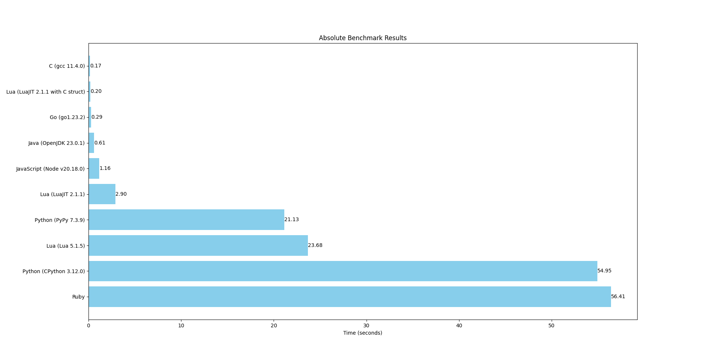
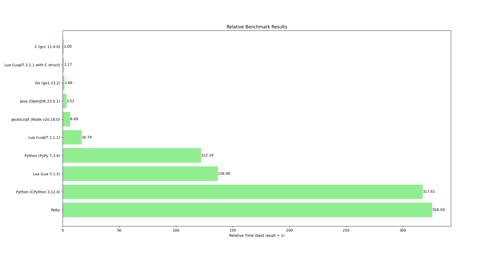
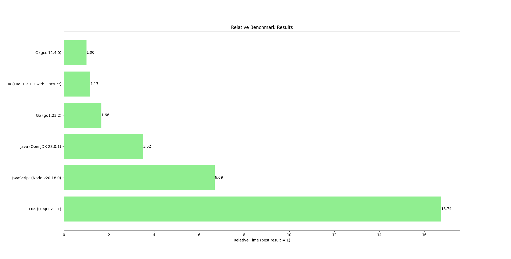
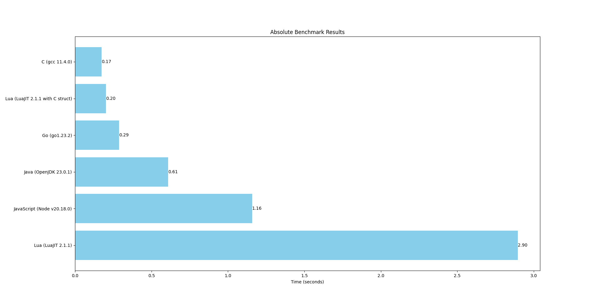

# Benchmark of several lanugages

- Ruby (ruby 3.3.6)
- Python (CPython 3.12.0, PyPy 7.3.9 with GCC 11.3.0)
- Lua (Lua 5.1.5, LuaJIT 2.1.1, LuaJIT 2.1.1 with C struct)
- JavaScript (Node v20.18.0)
- Java (OpenJDK 23.0.1)
- Go (go1.23.2)
- C (gcc 11.4.0)






## `Ruby`
```shell
ryzh@ryzh-MaiBook-M:~/Downloads/Languages/lua/projects/ffi$ time ruby bench.rb

real    0m56,414s
user    0m56,363s
sys     0m0,047s
```

## `Python (CPython 3.12.0)`
```shell
ryzh@ryzh-MaiBook-M:~/Downloads/Languages/lua/projects/ffi$ time python bench.py 

real    0m54,948s
user    0m54,925s
sys     0m0,021s
```

## `Lua (Lua 5.1.5)`
```shell
ryzh@ryzh-MaiBook-M:~/Downloads/Languages/lua/projects/ffi$ time lua bench.lua

real    0m23,683s
user    0m23,660s
sys     0m0,021s
```

## `Python (PyPy 7.3.9)`
```shell
ryzh@ryzh-MaiBook-M:~/Downloads/Languages/lua/projects/ffi$ time pypy3 bench.py

real    0m21,133s
user    0m20,888s
sys     0m0,242s
```

## `Lua (LuaJIT 2.1.1)`
```shell
ryzh@ryzh-MaiBook-M:~/Downloads/Languages/lua/projects/ffi$ time luajit bench.lua

real    0m2,896s
user    0m2,873s
sys     0m0,023s
```

## `JavaScript (Node v20.18.0)`
```shell
ryzh@ryzh-MaiBook-M:~/Downloads/Languages/lua/projects/ffi$ time node bench.js 

real    0m1,158s
user    0m1,142s
sys     0m0,033s
```

## `Java (OpenJDK 23.0.1)`
```shell
ryzh@ryzh-MaiBook-M:~/Downloads/Languages/lua/projects/ffi$ javac bench.java
ryzh@ryzh-MaiBook-M:~/Downloads/Languages/lua/projects/ffi$ time java bench

real    0m0,609s
user    0m0,610s
sys     0m0,028s
```

## `Go (go1.23.2)`
```shell
ryzh@ryzh-MaiBook-M:~/Downloads/Languages/lua/projects/ffi$ go build -o gobench bench.go
ryzh@ryzh-MaiBook-M:~/Downloads/Languages/lua/projects/ffi$ time ./gobench

real    0m0,288s
user    0m0,282s
sys     0m0,008s
```

## `Lua (LuaJIT 2.1.1 with C struct)`
```shell
ryzh@ryzh-MaiBook-M:~/Downloads/Languages/lua/projects/ffi$ time luajit bench_ffi.lua

real    0m0,203s
user    0m0,200s
sys     0m0,003s
```

## `C (gcc 11.4.0)`
```shell
ryzh@ryzh-MaiBook-M:~/Downloads/Languages/lua/projects/ffi$ gcc -march=native -O2 -o gccbench bench.c
ryzh@ryzh-MaiBook-M:~/Downloads/Languages/lua/projects/ffi$ time ./gccbench

real    0m0,173s
user    0m0,167s
sys     0m0,005s
```

