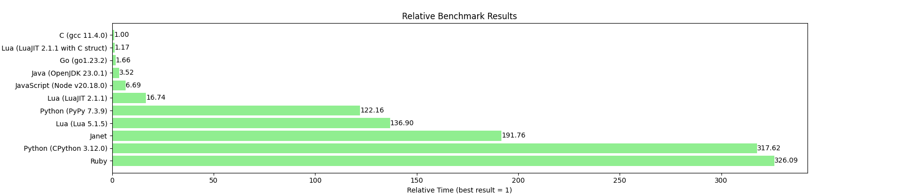
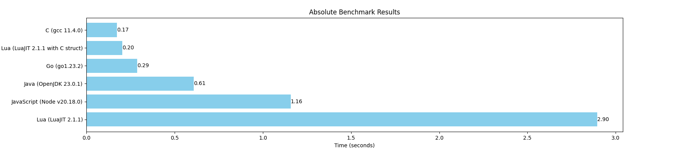
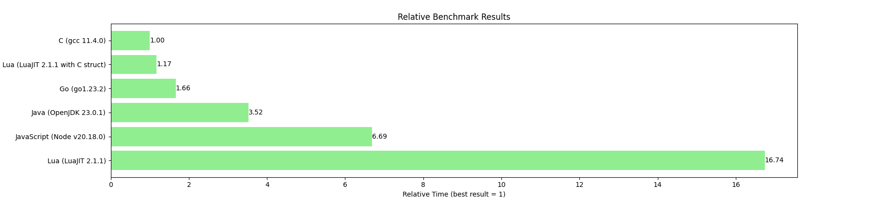

# Benchmark of several lanugages

- Ruby (ruby 3.3.6)
- Python (CPython 3.12.0, PyPy 7.3.9 with GCC 11.3.0)
- Lua (Lua 5.1.5, LuaJIT 2.1.1, LuaJIT 2.1.1 with C struct)
- JavaScript (Node v20.18.0)
- Java (OpenJDK 23.0.1)
- Go (go1.23.2)
- C (gcc 11.4.0)

|                                  | C (gcc 11.4.0) | Lua (LuaJIT 2.1.1 with C struct) | Go (go1.23.2) | Java (OpenJDK 23.0.1) | JavaScript (Node v20.18.0) | Lua (LuaJIT 2.1.1) | Python (PyPy 7.3.9) | Lua (Lua 5.1.5) | Janet | Python (CPython 3.12.0) | Ruby  |
|----------------------------------|----------------|----------------------------------|---------------|-----------------------|----------------------------|--------------------|---------------------|-----------------|-------|-------------------------|-------|
| C (gcc 11.4.0)                   | 1.0            | 0.852                            | 0.601         | 0.284                 | 0.149                      | 0.06               | 0.008               | 0.007           | 0.005 | 0.003                   | 0.003 |
| Lua (LuaJIT 2.1.1 with C struct) | 1.173          | 1.0                              | 0.705         | 0.333                 | 0.175                      | 0.07               | 0.01                | 0.009           | 0.006 | 0.004                   | 0.004 |
| Go (go1.23.2)                    | 1.665          | 1.419                            | 1.0           | 0.473                 | 0.249                      | 0.099              | 0.014               | 0.012           | 0.009 | 0.005                   | 0.005 |
| Java (OpenJDK 23.0.1)            | 3.52           | 3.0                              | 2.115         | 1.0                   | 0.526                      | 0.21               | 0.029               | 0.026           | 0.018 | 0.011                   | 0.011 |
| JavaScript (Node v20.18.0)       | 6.694          | 5.704                            | 4.021         | 1.901                 | 1.0                        | 0.4                | 0.055               | 0.049           | 0.035 | 0.021                   | 0.021 |
| Lua (LuaJIT 2.1.1)               | 16.74          | 14.266                           | 10.056        | 4.755                 | 2.501                      | 1.0                | 0.137               | 0.122           | 0.087 | 0.053                   | 0.051 |
| Python (PyPy 7.3.9)              | 122.156        | 104.103                          | 73.378        | 34.701                | 18.25                      | 7.297              | 1.0                 | 0.892           | 0.637 | 0.385                   | 0.375 |
| Lua (Lua 5.1.5)                  | 136.896        | 116.665                          | 82.233        | 38.888                | 20.452                     | 8.178              | 1.121               | 1.0             | 0.714 | 0.431                   | 0.42  |
| Janet                            | 191.757        | 163.419                          | 115.188       | 54.473                | 28.648                     | 11.455             | 1.57                | 1.401           | 1.0   | 0.604                   | 0.588 |
| Python (CPython 3.12.0)          | 317.618        | 270.68                           | 190.792       | 90.227                | 47.451                     | 18.974             | 2.6                 | 2.32            | 1.656 | 1.0                     | 0.974 |
| Ruby                             | 326.092        | 277.901                          | 195.882       | 92.634                | 48.717                     | 19.48              | 2.669               | 2.382           | 1.701 | 1.027                   | 1.0   |






## `Ruby`
```shell
ryzh@ryzh-MaiBook-M:~/Downloads/Languages/lua/projects/ffi$ time ruby bench.rb

real    0m56,414s
user    0m56,363s
sys     0m0,047s
```

## `Python (CPython 3.12.0)`
```shell
ryzh@ryzh-MaiBook-M:~/Downloads/Languages/lua/projects/ffi$ time python bench.py 

real    0m54,948s
user    0m54,925s
sys     0m0,021s
```

## `Janet`
```shell
ryzh@ryzh-MaiBook-M:~/Downloads/Languages/lua/projects/ffi$ time janet bench.janet 

real    0m33,174s
user    0m33,123s
sys     0m0,035s
```

## `Lua (Lua 5.1.5)`
```shell
ryzh@ryzh-MaiBook-M:~/Downloads/Languages/lua/projects/ffi$ time lua bench.lua

real    0m23,683s
user    0m23,660s
sys     0m0,021s
```

## `Python (PyPy 7.3.9)`
```shell
ryzh@ryzh-MaiBook-M:~/Downloads/Languages/lua/projects/ffi$ time pypy3 bench.py

real    0m21,133s
user    0m20,888s
sys     0m0,242s
```

## `Lua (LuaJIT 2.1.1)`
```shell
ryzh@ryzh-MaiBook-M:~/Downloads/Languages/lua/projects/ffi$ time luajit bench.lua

real    0m2,896s
user    0m2,873s
sys     0m0,023s
```

## `JavaScript (Node v20.18.0)`
```shell
ryzh@ryzh-MaiBook-M:~/Downloads/Languages/lua/projects/ffi$ time node bench.js 

real    0m1,158s
user    0m1,142s
sys     0m0,033s
```

## `Java (OpenJDK 23.0.1)`
```shell
ryzh@ryzh-MaiBook-M:~/Downloads/Languages/lua/projects/ffi$ javac bench.java
ryzh@ryzh-MaiBook-M:~/Downloads/Languages/lua/projects/ffi$ time java bench

real    0m0,609s
user    0m0,610s
sys     0m0,028s
```

## `Go (go1.23.2)`
```shell
ryzh@ryzh-MaiBook-M:~/Downloads/Languages/lua/projects/ffi$ go build -o gobench bench.go
ryzh@ryzh-MaiBook-M:~/Downloads/Languages/lua/projects/ffi$ time ./gobench

real    0m0,288s
user    0m0,282s
sys     0m0,008s
```

## `Lua (LuaJIT 2.1.1 with C struct)`
```shell
ryzh@ryzh-MaiBook-M:~/Downloads/Languages/lua/projects/ffi$ time luajit bench_ffi.lua

real    0m0,203s
user    0m0,200s
sys     0m0,003s
```

## `C (gcc 11.4.0)`
```shell
ryzh@ryzh-MaiBook-M:~/Downloads/Languages/lua/projects/ffi$ gcc -march=native -O2 -o gccbench bench.c
ryzh@ryzh-MaiBook-M:~/Downloads/Languages/lua/projects/ffi$ time ./gccbench

real    0m0,173s
user    0m0,167s
sys     0m0,005s
```

